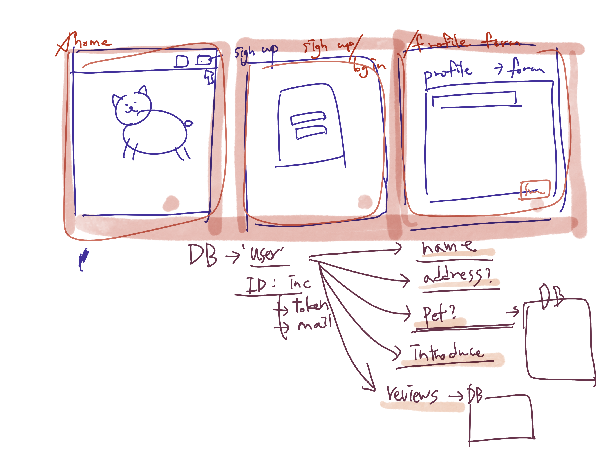
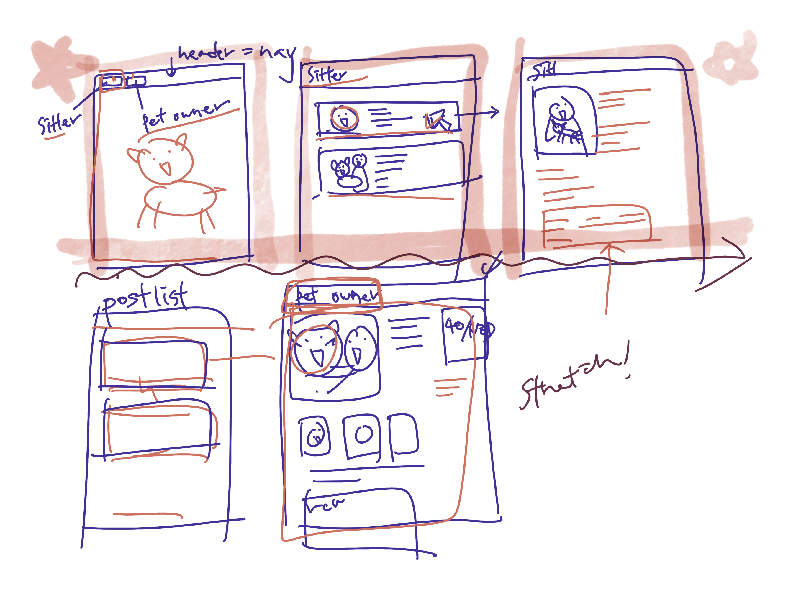
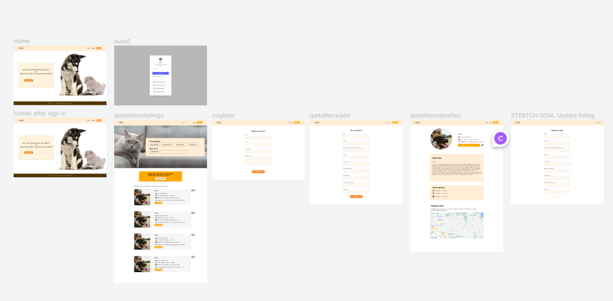

<h2 align="center">PETSITTER</h2>

  

---

## 😎Team member 
- Product Owner: Hiro
- Scrum Master: Claire
- Front-end Lead: Jinny
- Back-end Lead: Joanne
- Git Keeper: Sadie

# ✏ Wireframe and sketch

 
 
 

# 📐Figma

Figma UI design : <a href = "https://www.figma.com/file/mkNJKfL1XmMBqWWyjeyZ2A/PetSitter?node-id=0%3A1"
>PetSitter UI design by Chihiro</a>
 
 
 

# 📖Planning

1. Wed Afternoon: Team announcement  / We started answering the planning given by the facilitators including the conflict resolution plan 
2. Thursday: We talked about the features more./ Started discussing features (scope)we want for the app / discussed how the database would look like / How our form will look like based on the data we want to collect (display). All day. We had confusion about the data structure. Took awhile for everyone in the group to understand what the database looked like. Communication was more difficult over remote conversation, but it was important that we took time to ensure that everyone understood the DB. 
3. Friday: Morning: Finalised the details and Hiro had the figma set-up. We started actually coding in the Afternoon.
    
    Claire was Backend with Joanne in the beginning, and then quickly realised that there isn’t as much work so switched to the Front-end team. Flexibility, adaptability?? 
    
4. Saturday: Took a day off
5. Sunday: Gathered at 9am to continue coding ( Normal working hours ). 
6. Monday: Morning: Achieved MVP. Some people started doing stretches. Afternoon: Some people’s focus was more shifted towards CSS.
7. Tuesday: We were mainly working on stretch goals / experimenting with new features or brushing up CSS.
8. Wednesday: Came together in person. Finishing off the stretch features e.g edit. We went through the website together to finalise small details. Began discussing the presentation.
9. Thursday: Whole group prepared for the presentation together.
 
 
 

# What we learn for this project

- ## Technical
    1. Committing frequently
    2. Good task distribution and contribution to the project.
    3. Fixing merge conflicts as a team
    4. Documentation of everything
    5. Stretch goals - we were ambitious and we met many of them

- ## Human skills 
    1. Communication - (discord and in person), with facilitators
    2. Supporting each other
    3. Created conflict resolution - great planning stage
    4. Worked in agile - did stand ups and retros daily, kept to our roles,

